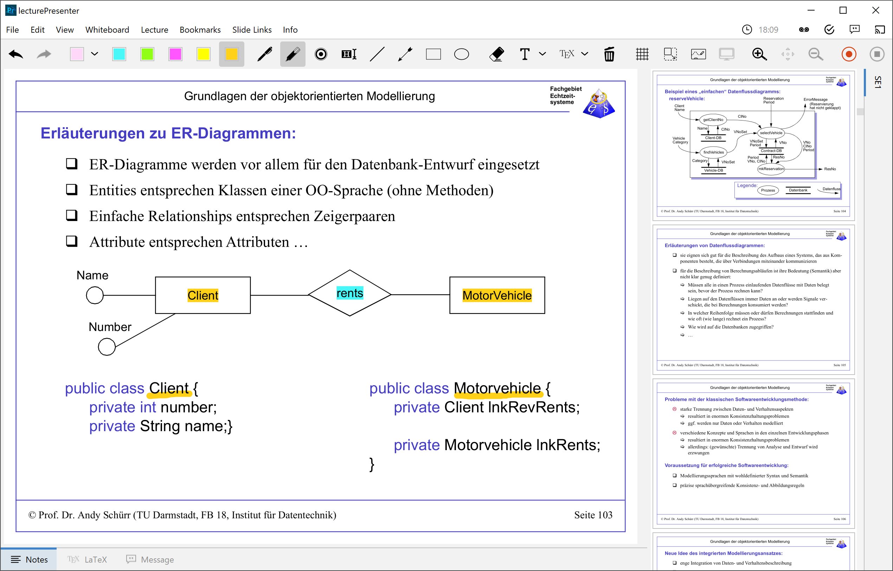
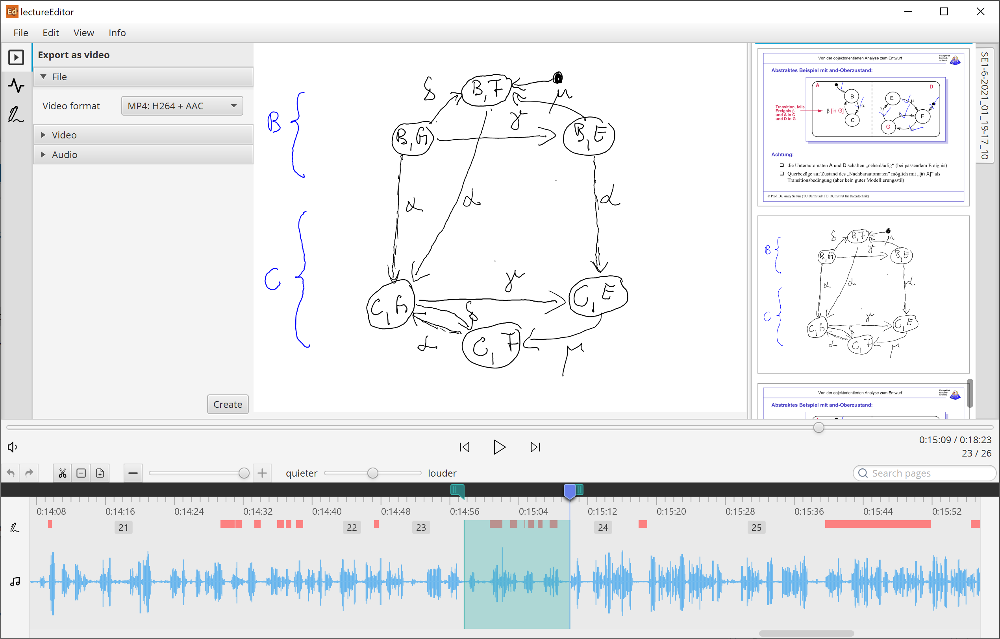

## lectureStudio

lectureStudio is a open and royalty-free software for e-teaching with support for Windows, Mac OS and Linux. It offers a multitude of possibilities: This starts with the presentation of PDF-based slide sets, including the possibility of pen annotations and digital whiteboards. These two features for use in interactive teaching scenarios (classroom, lecture hall) are enhanced by a quiz system with which surveys can be carried out very easily, in which the audience can participate directly by using own mobile devices in accordance with GDPR without the use of special apps or external servers. For remote teaching, recordings and bandwidth-saving live streaming are integrated directly into the software.

### Screenshots
#### lecturePresenter


#### lectureEditor


### Build Notes

In order to build the code, be sure to install the prerequisite software:

Please make sure you have installed and selected at least JDK 14 on your build system.

<table>
  <tr>
    <td>Windows</td>
    <td><a href="https://wixtoolset.org">WiX toolset</a> and <a href="https://developer.microsoft.com/windows/downloads/windows-10-sdk">Windows 10 SDK</a> <b>(Only, if you want to build the MSI installer)</b></td>
  </tr>
</table>

Assuming you have all the prerequisites installed for your OS, run:

```
mvn install
```

If you don't want to create the MSI installer on Windows, run:

```
mvn install -P !package:msi
```

### Sponsors

This project is financially supported by:


**Collaborative Research Centre 1053**
<br>
<a href="https://www.maki.tu-darmstadt.de" target="_blank">MAKI – Multi-Mechanisms Adaptation for the Future Internet</a>
<br>


**TU Darmstadt &ndash; Department of Electrical Engineering and Information Technology (FB18)**
<br>
<a href="https://www.es.tu-darmstadt.de/en/es" target="_blank">Real-Time Systems Lab (ES)</a>
<br>


**TU Darmstadt &ndash; Computer Science Department (FB20)**
<br>
<a href="https://www.esa.informatik.tu-darmstadt.de" target="_blank">Embedded Systems & Applications Group (ESA)</a>
<br>

